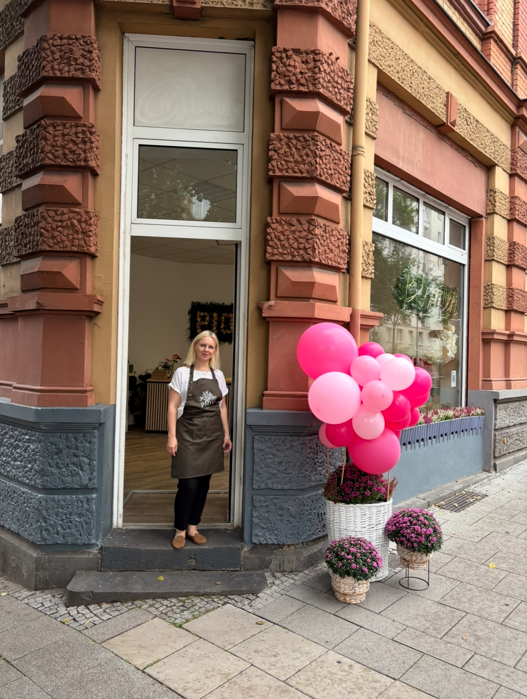
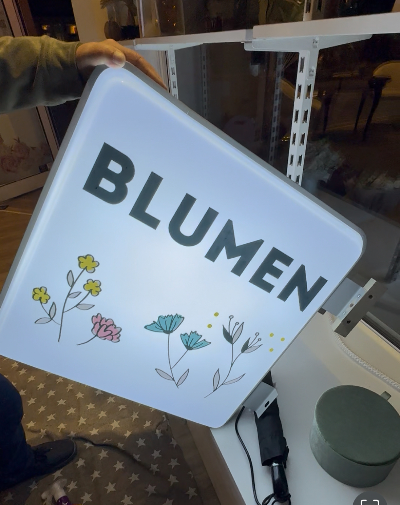
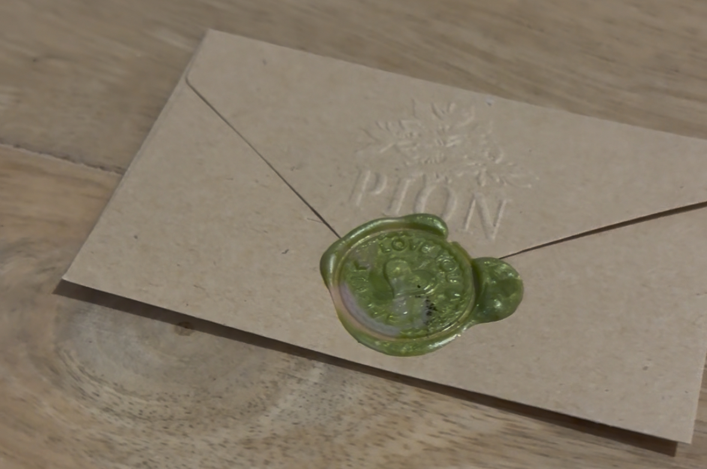

03.10.2025

Привет,  Это Женя и Никита из Германии. 

Пока что это просто обычный оффлайн магазин цветов. Почему именно магазин цветов? Да все просто  - моя жена флорист, она уже 2 года работала в одном магазине цветов в нашем городе и каждый раз когда она приходила домой она говорила что в магазине что-то делается все не так как надо. То цветы заказываются не такие, то бумага цвета детской неожиданности, то еще что-то. И не смотря на это магазин приносил небольшую прибыль, по крайней мере так ощущалось. Собственно именно явные недостатки текущего магазина стимулировали ее на 2 вещи: 
- или найти другой магазин для работы и работать там 
- или открыть свой магазин и делать как нам хочется.

Я сам всегда интересовался бизнесом, так как работая просто программистом мне не нравится то что когда я просто пишу код, то я не особо понимаю как мои действия повлияли на рост (или не повлияли) бизнеса, а тем более моего прихода денег. Мне не нравится в найме то, что я не чувствую что я влияю на развитие фирмы и моя зп не меняется. в бизнесе - все понятно, сделал действие - вот тебе ответ в виде денег. Я не сильно обращаю внимание на временной лаг, когда что-то делаешь - и потом тока через время видишь результаты, я готов ждать результат годами, но так как должны быть какие то микроизменения-маркеры то становится проще, в найме их как правило нет. У меня есть пара проектов которые приносят копеечку, но это очень мало. Хочется именно настоящий бизнес.

То есть наша мотивация сделать бизнес который нам нравится в котором мы можем получать удовольствие и деньги. 

мы начали вынашивать эту идею с начала 2025 года. И Женя нашла помещение 1 июня и оно уже стало доступным 1 сентября а ключи мы получили 1 августа. Помещение стоит 1000 евро , причем первоначальный взнос составил 3000 евро. 
Кое каких денег мы скопили, а 10 000 заняли. Эти деньги ушли на покупку холодильника для цветов, выплату за август месяц, предоплату итд, 

Итак мы запустились 1 сентября. В первый месяц пришли все наши друзья и поддержали нас покупкой букетов. Это было очень приятно, если вы читаете этот блог то спасибо вам!

Сегодня - пятница день единства Германии поэтому выходной

Прошел месяц работы магазина по продаже цветов. Сентябрь был очень насыщенный. Наверно поэтому не было времени на ведение этого журнала. 
Месяц получился очень удачным. Нам удалось заплатить за аренду, оборот цветов и еще потратить деньги на всякие улучшения магазина. Например вывеска флажок который горит по вечерам и очень хорошо привлекает внимание. 

Теперь он стоит вот так

Спасибо каким-то блогерам которые дали совет не делать вывеску с названием магазина а написать просто "Цветы". Так как люди не знают что такое PION но могут понять о чем речь когда видят слово "Цветы". Так как у меня была такая шальная идея сделал вывеску именно с названием магазина.

За месяц пришло много разных людей. В начале конечно это были только знакомые. но в течение следующего времени - просто жители этого района. Мне нравится что люди которые заходят очень рады что на этом месте появился цветочный магазин. А не магазин по продаже кальянов  или еще чего то такого. можно сказать что мы приносим свет в этот район. который пестрит графити и прочим шлаком. 

Завершили месяц в +400 евро. всего потратили на цветы 3200 а приход составил 4500. 

Наши уровни по этому бизнесу
1. **оплатить аренду** +
2. **цветы и реклама** +
3. зп флористу  +/-
4. налоги  -
5. вернуть долги -
6. прибыль -
7. Траты на развитие -

можно сказать что мы находимся на 2 уровне.  Мы не строим сверх планов что бы не поймать демотивацию и поэтому наши ожидания на октябрь дойти до уровня 3. 

Мы познакомились с Геннадием - хозяином похоронного бюро. Очень позитивный человек. Я хочу ему настроить рекламный кабинет в гугле. Моя мотивация очень проста. Помогая ему находить клиентов я получаю тоже клиентов на цветы. 

Реклама.
Что сделано за месяц по рекламе ? Если не считать моих тупых ошибок в настройке гео то в целом работало все нормально. Я настроил 25 евро в день и в целом клиенты приходили . Моя идея в том что даже может быть цена клиентов и была выше чем нужно и она может быть не окупалась, но возможно что в будущем эти же самые клиенты и будут покупать у нас цветы. Еще гугл обещал дать 400 евро при условии что мы потратим 400 евро своих. мы потратили но ждем теперь от них 400 евро.

Фишкой стали конверты. С секретными посланиями. Людям это заходит. Для них то это вау эффект.  Идея очень простая - человек пока ждет букет - может написать секретное послание и потом мы запечатываем его в конверт, капаем расплавленным воском и проставляем печать. выглядит это так:

Моя роль как программиста в этом проекте и где здесь айтишка?
Когда я еще не открыл магазин то я себе придумал что можно сделать софт который бы упрощал работу флориста и помогал вести учет букетов и запасов. В целом идея здравая но в текущей ситуации когда нам нужно хотя б дойти до уровня 7 чтобы появилось время на инвестиции в проект сейчас это невозомжно. учитывая то что я работаю на работе с 9 до 6 и вечером уже не хватает ментальной энергии. Поэтому я пока что даже не запустил сайт. 
Моих сил едва хватало на то что бы вести видео блог о проекте в тиктоке инстаграме и youtube. по сути на эту работу уходили силы по остаточному принципу поэтому и такая не регулярность. 

План на октябрь в контексте магазина.
1. запустить сайт 
2. выйти на уровень 3 

до связи!
